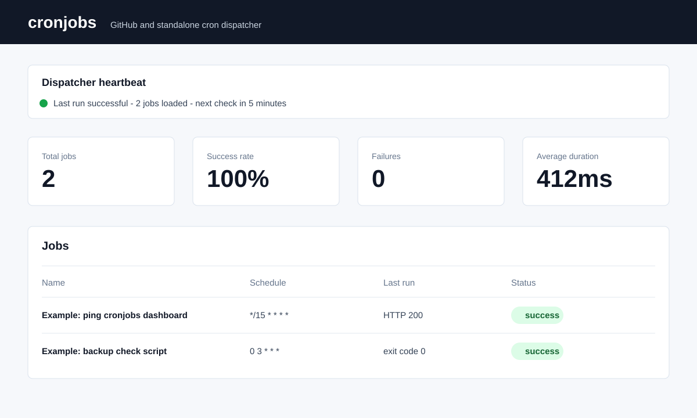

# cronjobs

[](https://github.com/dibyanshusinha/cronjobs/actions/workflows/validate.yml)

`cronjobs` is a Node.js cron dispatcher for scheduled HTTP requests and scripts.
It can run as a free GitHub-native public cron runner, or as a private
self-hosted Docker Compose service.

Jobs are plain YAML files under `jobs/`. The same shared engine handles job
discovery, `_defaults.yml` inheritance, schema validation, cron calculation,
misfire handling, retries, timeouts, execution, deduplication, history, and
dashboard summary generation for both deployment modes.



## Documentation

- [Release notes](RELEASE_NOTES.md)
- [Self-hosted deployment guide](docs/self-hosted.md)
- [Contributing guide](CONTRIBUTING.md)
- [Security policy](SECURITY.md)

## Deployment Modes

| Mode | Scheduler | Storage | Dashboard | Notifications | Best for |
| --- | --- | --- | --- | --- | --- |
| GitHub edition | GitHub Actions every 5 minutes | `cron-state` branch JSON | GitHub Pages | GitHub Issues | Public, non-sensitive jobs |
| Standalone edition | Internal Node scheduler loop | SQLite | Authenticated local web server | Webhook/log adapter | Private jobs on your own server |

The standalone edition has no runtime dependency on GitHub Actions, GitHub
Pages, GitHub Issues, or the GitHub API.

## Project Status

Current status:

- GitHub edition is built, pushed, and verified with public example jobs.
- Standalone Docker edition is implemented locally and merged into `main`.
- Both deployment modes share the same Node.js core engine.
- State storage is abstracted behind the `StateBackend` contract.
- SQLite is the only standalone state backend enabled today.
- Local verification currently covers tests, job validation, npm audit, and
  Docker Compose configuration.
- The local branch may be ahead of the published GitHub branch until release
  commits are pushed.

Not started:

- PostgreSQL storage backend.
- Multi-user authentication.
- Encrypted secret store.
- First-class private job management UI.
- Additional notification adapters beyond GitHub Issues and standalone webhook/log.

Planned features:

- v1.1: richer standalone dashboard controls, more notification adapters,
  import-from-curl, and per-job run-now UI.
- v2.0: PostgreSQL adapter, multi-user auth, encrypted secret store, and
  first-class private job management UI.

## Architecture

```text
jobs/**/*.job.yml
        |
        v
src/engine/
  discovery -> schema -> scheduler -> dispatch -> executors
                                      |
                                      v
                            ledger + history + dashboard
                                      |
              +-----------------------+-----------------------+
              |                                               |
              v                                               v
src/adapters/github/                         src/adapters/standalone/
  GitHub Actions trigger                       internal timer
  cron-state JSON storage                      SQLite storage
  GitHub Issues notifications                  webhook/log notifications
  GitHub Pages dashboard                       authenticated HTTP dashboard/API
```

Core modules live under `src/engine/` and do not import deployment-specific
code. Adapters provide storage, notification, trigger, and hosting behavior.
State storage follows the `StateBackend` contract in `src/engine/state-backend.js`;
GitHub mode uses JSON files and standalone mode currently enables SQLite.

## Requirements

- Node.js `24.13.1`
- npm
- Docker and Docker Compose for standalone deployment

Node is pinned because the standalone SQLite adapter uses Node's built-in
`node:sqlite` module. That module currently emits an experimental warning; keep
the pinned Node version until SQLite behavior is deliberately retested.

## Project Layout

```text
.github/workflows/       GitHub Actions dispatcher and validation workflows
adapters/github/site/    Static dashboard shell used by GitHub Pages
docs/self-hosted.md      Standalone deployment guide
jobs/                    Example public job files and defaults
schema/job.schema.json   Job schema
scripts/                 Example script jobs
src/engine/              Shared scheduler, validator, executor, history core
src/adapters/github/     GitHub Actions, Issues, Pages adapter
src/adapters/standalone/ Docker/SQLite/authenticated server adapter
test/                    Node test suite
```

## GitHub Deployment

Use this mode only for jobs whose metadata can be public. A public repository
exposes job names, URLs, schedules, script source, dashboard data, and execution
history. GitHub Secrets hide secret values, but they do not make public job
definitions private.

1. Push the repository to GitHub.
2. Keep the repository public if you want free GitHub-hosted Actions minutes.
3. Run the **Dispatch cron jobs** workflow once manually.
4. Confirm the workflow creates the `cron-state` branch.
5. Enable GitHub Pages:

```text
Source: Deploy from a branch
Branch: cron-state
Folder: /docs
```

The workflow runs every 5 minutes:

```yaml
on:
  schedule:
    - cron: "*/5 * * * *"
  workflow_dispatch:
```

Generated operational state is written to `cron-state`, not `main`.

## Manual Dispatcher Runs

The dispatcher normally runs automatically every 5 minutes. Run it manually
when you want an immediate scan after changing jobs, dashboard code, or state.

To run the dispatcher manually from GitHub:

1. Open the repository on GitHub.
2. Go to **Actions**.
3. Select **Dispatch cron jobs**.
4. Click **Run workflow**.
5. Leave `job_id` empty to scan due jobs and refresh the dashboard.
6. Set `job_id` only when you want to run one specific job immediately.
7. Leave `force_disabled` unchecked unless you intentionally want to run a
   disabled or auto-disabled job.

Manual runs still write state, history, heartbeat, and dashboard updates to the
`cron-state` branch.

## Standalone Deployment

Use standalone mode for private jobs, private URLs, private scripts, and private
execution history.

1. Copy the example environment file:

```bash
cp .env.example .env
```

2. Edit `.env` and set at least one authentication option:

```text
DASHBOARD_PASSWORD=change-this-long-random-password
```

or:

```text
DASHBOARD_TOKEN=change-this-long-random-token
```

3. Start the service:

```bash
docker compose up -d --build
```

4. Check health:

```bash
curl http://127.0.0.1:8080/healthz
curl http://127.0.0.1:8080/readyz
```

5. Open the dashboard:

```text
http://127.0.0.1:8080/
```

6. View logs:

```bash
docker compose logs -f cron-dispatcher
```

7. Stop the service:

```bash
docker compose down
```

The default Compose file binds the dashboard to loopback only. For remote
access, put it behind a TLS reverse proxy and keep authentication enabled.

Runtime mounts:

```text
jobs/       read-only job definitions
scripts/    read-only script files
data/       SQLite database and runtime state
.env        local deployment configuration
```

Do not commit private jobs, private scripts, `.env`, SQLite files, backups, or
runtime data.

More detail is in `docs/self-hosted.md`.

## Example Jobs

The included example jobs are disabled by default. They are safe templates for
learning the job format without generating ongoing scheduled traffic.

To enable an example, change:

```yaml
enabled: false
```

to:

```yaml
enabled: true
```

Then commit and push the change. The dispatcher will pick it up on the next
scheduled run, or you can run the dispatcher manually for an immediate refresh.

## Job Defaults

Add `_defaults.yml` under `jobs/` or any subfolder to inherit common settings.
Deeper defaults override shallower defaults, and a job's own fields override all
defaults.

Example:

```yaml
timezone: UTC
enabled: true
retries: 2
retry_backoff_seconds: 30
timeout_seconds: 30
misfire_policy: most_recent
misfire_cap: 10
history_limit: 100
history_retention_days: 365
notify:
  on_failure: true
  on_recovery: true
failure_policy:
  auto_disable_after_consecutive_failures: 5
  initial_backoff_seconds: 300
  backoff_multiplier: 2
  max_backoff_seconds: 21600
```

## Adding HTTP Jobs

Create `jobs/<folder>/<name>.job.yml`:

```yaml
id: production-health
name: Production health
schedule: "*/15 * * * *"
timezone: UTC
enabled: true
type: http
retries: 2
retry_backoff_seconds: 30
http:
  method: GET
  url: "https://example.com/health"
  expected_status: [200]
  timeout_seconds: 10
  headers:
    User-Agent: cronjobs/1.0
```

Header values of the exact form `${VAR_NAME}` are substituted from environment
variables at execution time:

```yaml
http:
  headers:
    Authorization: "${MY_API_TOKEN}"
```

For GitHub mode, add `MY_API_TOKEN` as a GitHub Actions secret and expose it to
the dispatcher workflow step. For standalone mode, put it in `.env`, Docker
secrets, or a mounted secrets directory.

## Adding Script Jobs

Script jobs run committed or mounted files under `scripts/`:

```yaml
id: backup-check
name: Backup check
schedule: "0 3 * * *"
timezone: UTC
type: script
retries: 1
script:
  path: scripts/examples/backup_check.sh
  interpreter: bash
  args: ["--verbose"]
  timeout_seconds: 60
```

Security rules:

- no inline shell commands;
- no absolute paths;
- no `..` traversal;
- no symlink escape;
- script paths must resolve under `scripts/`;
- allowed interpreters are `bash`, `python3`, and `node`;
- stdout and stderr are not stored in history.

## Scheduler Behavior

The dispatcher uses cursor-based catch-up. It does not simply ask whether a cron
expression matches the current minute.

```text
last evaluated time < scheduled occurrence <= now
```

That makes delayed GitHub Actions runs and restarted standalone services more
robust.

Manual runs bypass the schedule, but not disabled or auto-disabled state unless
`force_disabled` is explicitly supplied.

## Misfire Handling

If multiple occurrences became due since the last evaluation:

- `most_recent` runs only the latest occurrence and records older ones as
  skipped;
- `all` runs every missed occurrence, capped by `misfire_cap`.

## Retries, Timeouts, And Auto-Disable

Each job supports retries and timeout configuration. Failed attempts back off
exponentially:

```yaml
retries: 2
retry_backoff_seconds: 30
failure_policy:
  auto_disable_after_consecutive_failures: 5
  initial_backoff_seconds: 300
  backoff_multiplier: 2
  max_backoff_seconds: 21600
```

After too many consecutive failures, the job is auto-disabled so the dispatcher
does not keep hammering an endpoint that may be broken, rate-limited, or
rejecting requests. A successful manual run can clear the failure state.

## Deduplication And Recovery

Every occurrence is identified by:

```text
jobId|scheduledTime
```

The ledger claims occurrences before execution and finalizes them after
execution. On restart, finalized occurrences are not executed again. Stale
running claims are reconciled so the system does not silently lose track of
interrupted work.

For non-idempotent endpoints, make the receiving service idempotent by checking
the `X-Cron-Execution-Id` header.

## Notifications

Notification behavior is adapter-based:

- GitHub mode uses GitHub Issues.
- Standalone mode can send a generic webhook, or log notifications when no
  webhook is configured.

Failures create or update a job-specific notification. Recovery can close or
resolve that notification depending on the adapter.

## Dashboard

The dashboard shows:

- dispatcher heartbeat;
- total jobs, failures, disabled jobs, 24-hour run count, success rate, and
  average duration;
- consolidated activity and status graphs;
- paginated searchable job list;
- focused per-job details with schedule, failure policy, recent history, status
  mix, and duration trend;
- a Create Job helper that generates YAML and can test public HTTP requests
  from the browser after confirmation.

The GitHub dashboard is static and published from `cron-state:/docs`. The
standalone dashboard is served by the local authenticated Node server.

## Backup And Restore

Standalone backups include jobs, scripts, backend state data, and a manifest:

```bash
npm run standalone:backup -- ./backups/manual-$(date +%Y%m%d)
```

Restore:

```bash
npm run standalone:restore -- ./backups/manual-20260802
```

Stop the standalone service before restoring backend state data.

In GitHub mode, operational state is in the `cron-state` branch. Job definitions
remain in `main`.

## Security Model

Public GitHub mode:

- use only public, non-sensitive jobs;
- keep secrets in GitHub Actions secrets;
- never commit credentials, private URLs, or private scripts;
- remember that dashboard history is public.

Standalone mode:

- keep `ALLOW_NO_AUTH=false` outside local development;
- any non-loopback exposure must require authentication;
- bind to `127.0.0.1` by default;
- put remote access behind TLS and a reverse proxy;
- mount jobs and scripts read-only;
- store secrets in `.env`, Docker secrets, or mounted secret files;
- keep `data/`, `backups/`, SQLite files, and `.env` out of Git.

Shared protections:

- script path traversal and symlink escapes are blocked;
- HTTP redirects are not followed automatically;
- response reads are capped;
- history details are capped and redact likely secret environment values;
- full HTTP bodies, request headers, script output, and credentials are not
  stored in dashboard history.

## Configuration

Standalone configuration comes from environment variables:

```text
DASHBOARD_USER
DASHBOARD_PASSWORD
DASHBOARD_TOKEN
ALLOW_NO_AUTH
HOST
PORT
POLL_SECONDS
MAX_CONCURRENCY
DATA_DIR
STATE_BACKEND
SQLITE_PATH
JOBS_DIR
SCRIPTS_ROOT
SECRETS_DIR
NOTIFY_WEBHOOK_URL
```

See `.env.example` for defaults.

## Development

```bash
npm install
npm run validate
npm test
npm audit
docker compose config
```

Run the standalone server locally:

```bash
ALLOW_NO_AUTH=true npm run standalone:start
```

`ALLOW_NO_AUTH=true` is development-only.

## Troubleshooting

**The GitHub workflow did not run exactly on time.**
GitHub scheduled workflows are best-effort. The cursor-based catch-up logic is
designed for delayed runs.

**The dashboard is stale.**
Check the dispatcher heartbeat. In GitHub mode, confirm the Actions workflow is
enabled and `cron-state` is updating. In standalone mode, check `/healthz`,
`/readyz`, and container logs.

**Pages returns 404.**
Enable Pages from `cron-state` and `/docs` after the first dispatcher run
creates the branch.

**A job keeps failing.**
Inspect the job detail view, failure policy, timeout, expected status codes, and
receiving service logs. Exponential backoff and auto-disable may pause further
runs.

**A standalone dashboard request returns 401.**
Use Basic auth with `DASHBOARD_USER` and `DASHBOARD_PASSWORD`, or Bearer auth
with `DASHBOARD_TOKEN`.

**SQLite prints an experimental warning.**
That is expected for now. Node is pinned to `24.13.1`, and SQLite behavior is
covered by tests.

## FAQ

**Can this replace cron-job.org completely?**
It covers scheduled HTTP requests, scripts, retries, history, notifications,
and dashboards. GitHub mode has a 5-minute cadence. Standalone mode can poll
more frequently.

**Can I keep private jobs in the public GitHub repo?**
No. Secrets can be hidden, but job URLs, names, schedules, scripts, and history
are public. Use standalone mode for private jobs.

**Can I add a PostgreSQL storage adapter later?**
Yes. Storage is behind the state backend interface used by the ledger and
history store. SQLite is the only standalone backend enabled today; a future
PostgreSQL backend can be added at the standalone backend factory without
changing scheduler, ledger, history, or dashboard logic.

**Can I add Slack, email, or Discord notifications?**
Yes. Notifications are adapter-based. Add another notifier without changing the
shared scheduler or executor core.

**Does standalone mode need GitHub at runtime?**
No.

**Does GitHub mode still work after adding standalone mode?**
Yes. The GitHub adapter still uses the same shared Node core and its existing
GitHub Actions workflow.
